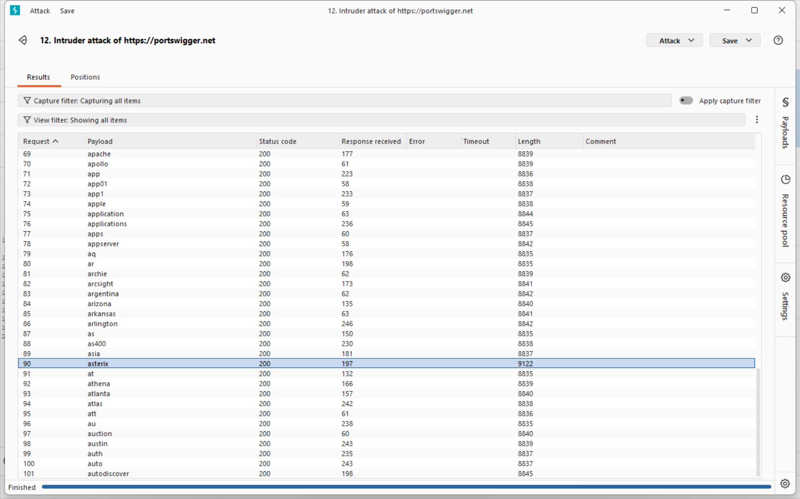
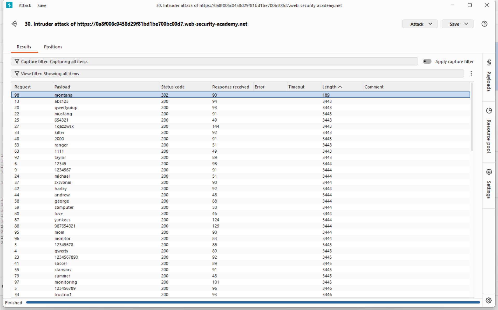

## Lab 2, medium: Username enumeration via subtly different responses

### Attack class

Same attack class as in Lab 1. Username enumeration is an information disclosure brute-force attack where the application's responses reveal whether a submitted username exists in the system. By observing differences in error messages, HTTP status codes, response lengths, or response timing between login attempts with valid versus invalid usernames, an attacker can build a list of confirmed accounts without ever logging in. This list then serves as the input set for targeted follow-up attacks such as password brute-forcing, credential stuffing, or password spraying.

### Impact

On its own, username enumeration is a low-severity finding - the attacker only learns which accounts exist. However, it is almost always a - - Stepping stone that dramatically increases the success rate of subsequent attacks:

Targeted brute-force becomes feasible because the attacker no longer wastes attempts on non-existent accounts, and rate-limiting protections that block N attempts per username are easier to evade when the attacker knows exactly which usernames to target.
- Credential stuffing attacks using leaked breach databases become more efficient.
- Privacy violations occur when the application's user base is sensitive (e.g., a medical or adult-content platform confirming a specific person is registered).
- Social engineering becomes more credible when the attacker can reference a valid account in a phishing message.

### Software weaknesses that enabled the attack

- The login endpoint returned different error messages for invalid username ("Invalid username") versus invalid password ("Incorrect password"), directly leaking account existence.
- The responses had different lengths, making automated enumeration trivial through Burp Intruder's response length column even if error messages were partially obfuscated.
- No rate limiting was applied to the login endpoint, allowing thousands of enumeration attempts from the same IP.
- The application did not use a constant-time response path - even if the messages were identical, timing differences between "user not found" (fast) and "user found, password check" (slow bcrypt comparison) could be measured.

### Countermeasures

#### Uniform response behavior is the primary defense. All authentication failures must be indistinguishable to an unauthenticated client:

- Return a single generic error message for every failure case - e.g., "Invalid username or password" - regardless of whether the username exists, the password is wrong, or the account is locked.
- Ensure responses have identical HTTP status codes, identical body length, and identical headers across all failure paths. Do not include conditional fields (e.g., "account locked" flags) that vary by case.
- Enforce constant-time processing by running the password-hash comparison (bcrypt/argon2) even when the username does not exist, using a dummy hash. This neutralizes timing side-channels.

#### Rate limiting and monitoring close the remaining gap:

- Apply per-IP and per-account rate limits on /login (e.g., 5 attempts per minute, exponential backoff thereafter).
- Implement CAPTCHA or proof-of-work challenges after a small number of failed attempts.
- Log and alert on enumeration patterns - a single IP submitting hundreds of distinct usernames within minutes is a clear signal.
- Use WAF rules to detect automated tools (consistent User-Agent, request timing, absence of typical browser headers).

#### Defense-in-depth for related surfaces:

- Apply the same uniform-response principle to password reset, registration ("this email is already taken" is the same leak), and account recovery endpoints.
- Enforce strong password policies and encourage 2FA so that even a successfully enumerated + brute-forced password is not sufficient for account takeover.
- Consider account-agnostic authentication flows (e.g., email-based magic links) for high-value accounts where username privacy matters.

## Solution writeup
Goal: Log in to the victim account using the username and password wordlists provided by PortSwigger. Unlike the previous lab, the application does not reveal account existence through distinct error messages - the differences are subtle and require more careful analysis.

- Step 1 - Capture the login request
Submit a login attempt with dummy credentials while Burp Proxy is intercepting. Locate the POST /login request in HTTP history and send it to Intruder (Ctrl+I).
- Step 2 - Enumerate valid usernames

In Intruder:

Attack type: Sniper
Payload position: username=§invalid§&password=test
Payload list: PortSwigger's candidate usernames

Launch the attack. Since the error message is visually identical for every failure, sort the results by Length and look for anomalies. One response is a few bytes longer than the rest - the difference is caused by a minor variation in the returned error string (e.g., a trailing period or whitespace). That payload is the valid username.

- Step 3 - Brute-force the password
Send a new POST /login to Intruder with the discovered username fixed:

Attack type: Sniper
Payload position: username=<found_username>&password=§invalid§
Payload list: PortSwigger's candidate passwords

After the attack completes, sort by Status code. The request returning 302 Found instead of 200 OK indicates a successful login and redirect to the account page.

- Step 4 - Log in and solve the lab
Return to the login page and authenticate with the discovered credentials. The lab is marked solved.

Key difference from Lab 1
In the previous lab, different error messages ("Invalid username" vs "Incorrect password") made enumeration obvious. Here, the developers attempted a fix by standardizing the message - but failed to ensure byte-level identical responses. This is a common real-world failure pattern: partial remediation that removes the obvious signal while leaving a subtler one intact. Automated tools like Burp Intruder detect such differences instantly through the Length column.
