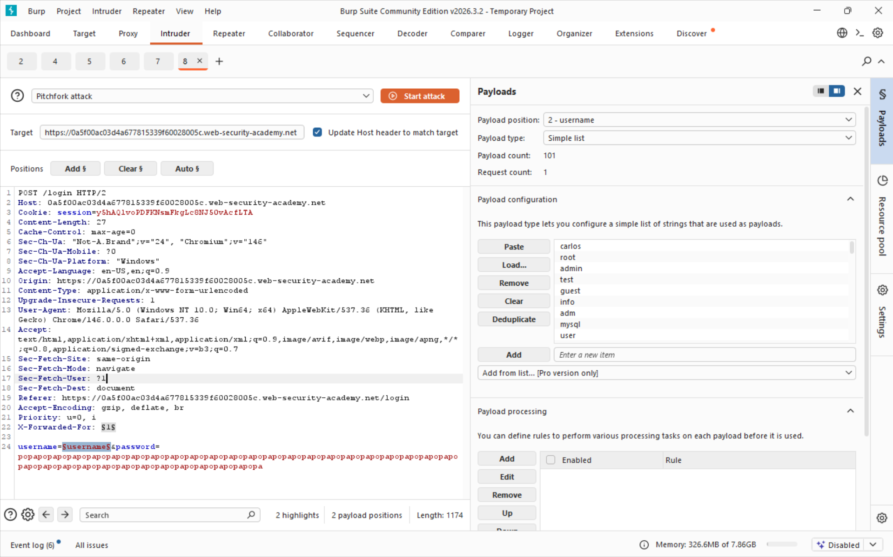
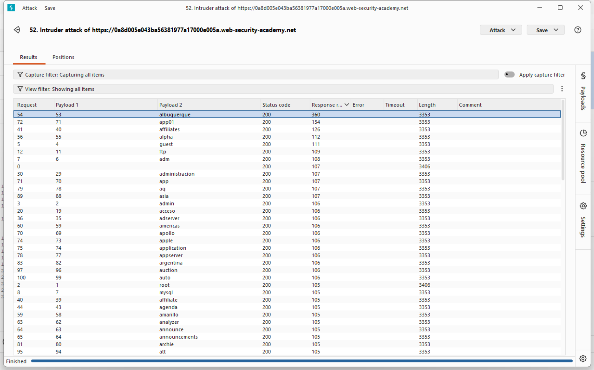
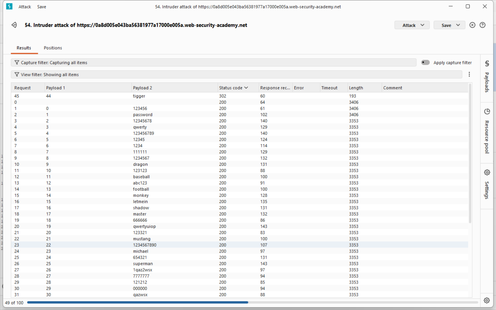

## Lab 3, medium: Username enumeration via response timing

### Attack class

Same attack class as in Lab 1. Username enumeration is an information disclosure brute-force attack where the application's responses reveal whether a submitted username exists in the system. By observing differences in error messages, HTTP status codes, response lengths, or response timing between login attempts with valid versus invalid usernames, an attacker can build a list of confirmed accounts without ever logging in. This list then serves as the input set for targeted follow-up attacks such as password brute-forcing, credential stuffing, or password spraying.

### Impact

On its own, username enumeration is a low-severity finding - the attacker only learns which accounts exist. However, it is almost always a - - Stepping stone that dramatically increases the success rate of subsequent attacks:

Targeted brute-force becomes feasible because the attacker no longer wastes attempts on non-existent accounts, and rate-limiting protections that block N attempts per username are easier to evade when the attacker knows exactly which usernames to target.
- Credential stuffing attacks using leaked breach databases become more efficient.
- Privacy violations occur when the application's user base is sensitive (e.g., a medical or adult-content platform confirming a specific person is registered).
- Social engineering becomes more credible when the attacker can reference a valid account in a phishing message.

### Software weaknesses that enabled the attack

- The application did not enforce constant-time processing on the login path. When a username does not exist the handler returns immediately, but when it does exist the server runs a bcrypt/argon2 comparison against the stored hash. With a sufficiently long submitted password the hash function runs for noticeably longer, creating a measurable timing side-channel that reveals valid usernames even when error messages are identical.
- The per-IP rate-limiting relied solely on the client's apparent IP address and trusted the `X-Forwarded-For` header without validation. An attacker can spoof a different IP on every request, effectively bypassing the lockout entirely.
- No secondary factor or CAPTCHA was required after repeated failures, so automated tooling could enumerate usernames and brute-force passwords unimpeded once the IP restriction was bypassed.

### Countermeasures

#### Uniform response behavior is the primary defense. All authentication failures must be indistinguishable to an unauthenticated client:

- Return a single generic error message for every failure case - e.g., "Invalid username or password" - regardless of whether the username exists, the password is wrong, or the account is locked.
- Ensure responses have identical HTTP status codes, identical body length, and identical headers across all failure paths. Do not include conditional fields (e.g., "account locked" flags) that vary by case.
- Enforce constant-time processing by running the password-hash comparison (bcrypt/argon2) even when the username does not exist, using a dummy hash. This neutralizes timing side-channels.

#### Rate limiting and monitoring close the remaining gap:

- Apply per-IP and per-account rate limits on /login (e.g., 5 attempts per minute, exponential backoff thereafter).
- Implement CAPTCHA or proof-of-work challenges after a small number of failed attempts.
- Log and alert on enumeration patterns - a single IP submitting hundreds of distinct usernames within minutes is a clear signal.
- Use WAF rules to detect automated tools (consistent User-Agent, request timing, absence of typical browser headers).

#### Defense-in-depth for related surfaces:

- Apply the same uniform-response principle to password reset, registration ("this email is already taken" is the same leak), and account recovery endpoints.
- Enforce strong password policies and encourage 2FA so that even a successfully enumerated + brute-forced password is not sufficient for account takeover.
- Consider account-agnostic authentication flows (e.g., email-based magic links) for high-value accounts where username privacy matters.

## Solution writeup

Goal: Log in to the victim account carlos using the username and password wordlists provided by PortSwigger. The application enforces per-IP rate limiting, so IP spoofing via `X-Forwarded-For` is required throughout.

- Step 1 - Capture the login request
Submit a login attempt with dummy credentials while Burp Proxy is intercepting. Locate the POST /login request in HTTP history and send it to Intruder. Manually add an `X-Forwarded-For` header to the request.

- Step 2 - Enumerate valid usernames via response timing
In Intruder, set the attack type to **Pitchfork**. Mark `X-Forwarded-For` value as payload position 1 and the username parameter as payload position 2. Set the password to a very long string (100+ characters) so that, for a valid username, the bcrypt comparison runs long enough to produce a clearly measurable delay. Payload 1 is a sequential number list (1, 2, 3 … matching the username list length); payload 2 is PortSwigger's candidate username wordlist. Launch the attack and sort results by **Response received** (timing column). The one username whose response takes noticeably longer than all others is valid - the server spent time hashing the long password instead of short-circuiting on "user not found".

- Step 3 - Brute-force the password
Send a fresh POST /login to Intruder, fix the discovered username, and set up a new Pitchfork attack: payload position 1 on `X-Forwarded-For` (new sequential number range), payload position 2 on the password parameter loaded with PortSwigger's candidate password wordlist. After the attack completes, sort by **Status code** - the single request returning **302 Found** (redirect to the account page) instead of 200 OK reveals the correct password.

- Step 4 - Log in and solve the lab
Return to the login page and authenticate with the discovered credentials to solve the lab.
