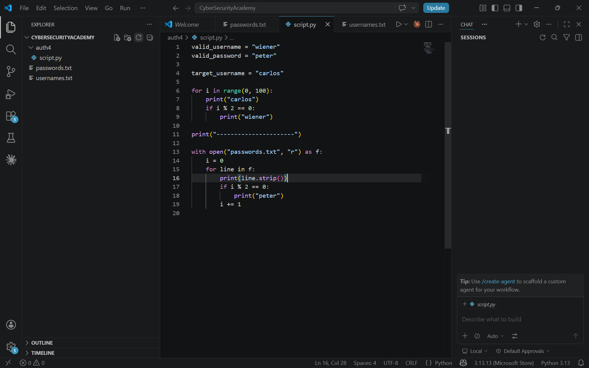
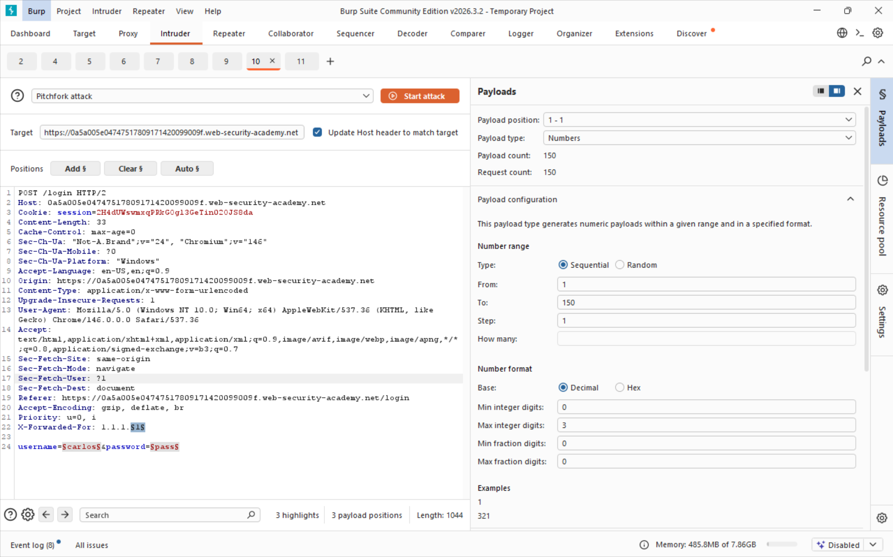
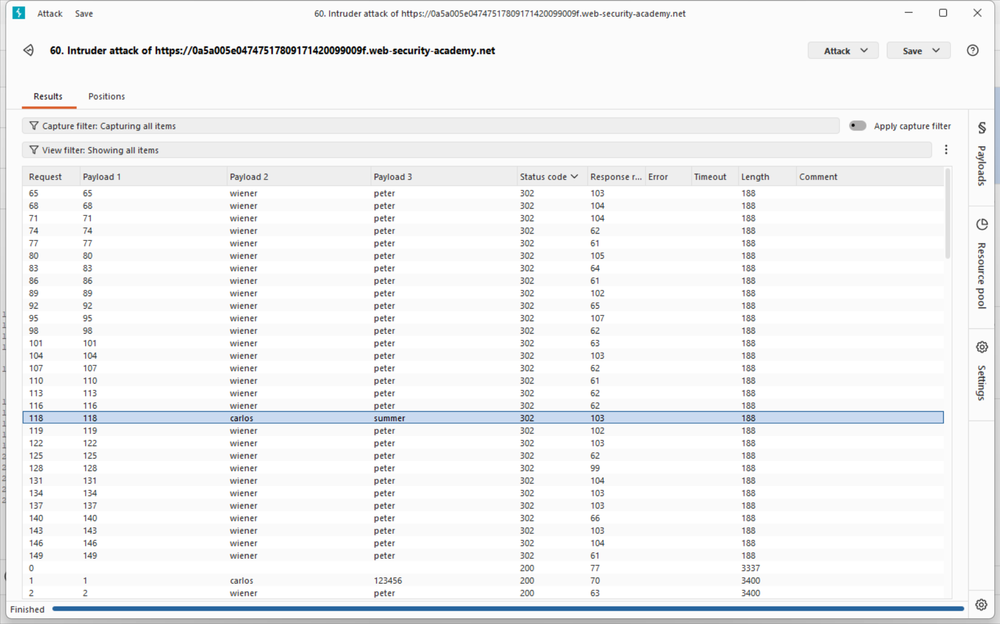

## Lab 4, medium: Broken brute-force protection, IP block

### Attack class

Flawed brute-force protection is a vulnerability class where an application implements a lockout or rate-limiting mechanism but does so in a way that can be systematically circumvented. In this lab the server blocks an IP after a fixed number of consecutive failed login attempts - but resets the counter whenever a successful authentication occurs from that same IP, regardless of which account logged in. An attacker who interleaves failed attempts against the target account with successful logins on a known account can keep the counter permanently below the lockout threshold, effectively bypassing the protection entirely and enabling unlimited brute-force against the target password.

### Impact

Unlike pure username enumeration, this vulnerability directly enables full account takeover. Because the attacker already knows the target username and can cycle through an entire password wordlist without ever hitting the lockout, the attack succeeds as soon as a candidate password matches. Consequences include:

- Complete takeover of the victim account and access to all associated data and functionality.
- The attack leaves no unusual lockout events in logs, since the counter resets cleanly on every interleaved successful login, making detection harder.
- If the application exposes any privileged functionality (admin panels, payment methods, personal data) the blast radius extends beyond a single account.
- The same technique generalises to any lockout scheme that ties the reset condition to a successful login rather than to a time window or explicit unlock action.

### Software weaknesses that enabled the attack

- The per-IP lockout counter reset on any successful authentication from that IP, not just for the account being attacked. Logging in as a legitimate own account was sufficient to erase all accumulated failure counts, allowing unlimited retries against the target.
- The lockout was IP-based only and trusted the `X-Forwarded-For` header without validation, providing a second independent bypass vector: an attacker can also spoof a new IP on every request to avoid the counter entirely.
- There was no per-account lockout independent of IP. Once the IP-level protection was bypassed, the target account had no remaining brute-force defence.
- No CAPTCHA or proof-of-work challenge was presented after repeated failures, so fully automated tooling could run the attack at network speed.

### Countermeasures

#### Lockout logic must be account-scoped and time-based, not tied to successful logins:

- Enforce a per-account failure counter that increments on every failed attempt for that account, regardless of which IP the request originates from. Do not reset this counter when a different account logs in successfully.
- Implement a time-based cooldown (e.g., lock the account for 15 minutes after 5 failures) rather than a reset-on-success scheme - time passes regardless of attacker actions.
- Treat the `X-Forwarded-For` and `X-Real-IP` headers as untrusted client input. Derive the real client IP from the transport layer or from a trusted reverse-proxy configured at the infrastructure level; never allow clients to self-report their own IP for security decisions.

#### Add friction that automated tools cannot easily bypass:

- Present a CAPTCHA or proof-of-work challenge after the first 2-3 failed attempts per account; this stops scripted brute-force even if the IP-spoofing bypass is present.
- Require re-authentication (e.g., email confirmation or TOTP code) before unlocking a locked account.
- Alert the account owner via email or push notification when their account is locked, exposing active attacks to the victim.

#### Defense-in-depth for related surfaces:

- Enforce strong password policies and encourage 2FA so that even a successful brute-force does not translate into account takeover.
- Log per-account failure counts and alert on anomalies - an account receiving hundreds of failed attempts over minutes is a clear signal even if no lockout is triggered.
- Apply the same account-scoped lockout logic to password reset, OTP verification, and any other credential-checking endpoint.

## Solution writeup

Goal: Log in to the victim account carlos using the password wordlist provided by PortSwigger. The application blocks an IP after a small number of consecutive failures but resets the counter on any successful login from that IP.

- Step 1 - Capture the login request
Submit a login attempt with dummy credentials while Burp Proxy is intercepting. Locate the POST /login request in HTTP history and send it to Intruder.

- Step 2 - Prepare interleaved payload lists with a script
The counter resets on every successful login, so every other request must be a successful authentication with the known credentials (own account). Write a short script that generates two payload files: a username list alternating `[carlos, wiener, carlos, wiener, …]` and a password list alternating `[candidate_1, peter, candidate_2, peter, …]` where `peter` is the known password for `wiener`. Every even-numbered request logs in as wiener:peter, resetting the failure counter; every odd-numbered request tries carlos with the next candidate password.

- Step 3 - Launch a Pitchfork attack
In Intruder set the attack type to **Pitchfork**. Add an `X-Forwarded-For` header to the request and mark it as payload position 1 (sequential number list to also cycle the apparent IP), payload position 2 on the username parameter (interleaved username list), payload position 3 on the password parameter (interleaved password list). All three payload lists iterate in lockstep.

- Step 4 - Identify the correct password
After the attack completes, sort results by **Status code**. All wiener:peter requests return 302, and all failed carlos attempts return 200. The one carlos request that also returns **302 Found** is the successful login - the corresponding candidate password is correct.

- Step 5 - Log in and solve the lab
Return to the login page and authenticate as carlos with the discovered password to solve the lab.
