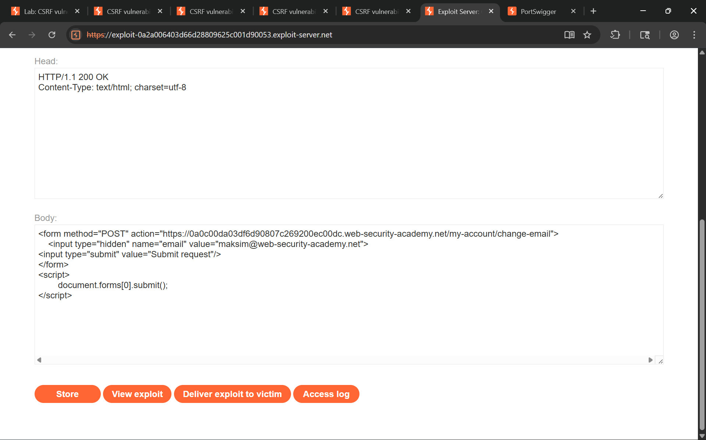

## Lab 1, easy: CSRF vulnerability with no defenses

### Attack class

Cross-Site Request Forgery (CSRF) is an attack that tricks an authenticated user's browser into sending an unintended state-changing request to a web application. Because browsers automatically attach session cookies to every request destined for the origin that issued them, a malicious page hosted on a different domain can silently trigger actions - account changes, fund transfers, password updates - on behalf of the victim without their knowledge or consent. The attack requires no knowledge of the victim's credentials; it hijacks the trust the application places in the browser's cookie-based session.

### Impact

A successful CSRF attack lets an attacker perform any action the victim is authorized to perform:

- Account takeover through email or password change (as in this lab).
- Unauthorized fund transfers or purchases if the target is a banking or e-commerce application.
- Privilege escalation when an administrator visits the malicious page - the attacker inherits admin-level permissions for that forged request.
- Data exfiltration or deletion if state-changing endpoints also return sensitive data in the response (combined with other techniques such as form-based cross-origin leaks).

The severity is directly proportional to the victim's privilege level and the sensitivity of available actions.

### Software weaknesses that enabled the attack

- The `/my-account/change-email` endpoint accepted POST requests and executed the email change based solely on the presence of a valid session cookie. No additional proof of intent (CSRF token, custom header, re-authentication) was required.
- The application did not validate the `Origin` or `Referer` header on state-changing requests, so cross-origin form submissions were indistinguishable from legitimate same-origin ones.
- The session cookie lacked the `SameSite` attribute, which caused the browser to attach it to cross-site requests, enabling the forged form submission to carry a fully authenticated session.
- The endpoint accepted `application/x-www-form-urlencoded` content, the default encoding for HTML forms, meaning no JavaScript was needed on the attacker's page to issue the request - a plain auto-submitting HTML form was sufficient.

### Countermeasures

#### Synchronizer token pattern is the primary defense:

- Generate a cryptographically random, per-session (or per-request) CSRF token on the server and embed it as a hidden field in every state-changing HTML form.
- Validate the submitted token server-side before processing the request. Reject any request where the token is absent, expired, or does not match the value bound to the current session.
- Never include the CSRF token in the URL (query string), as it can leak via `Referer` headers and browser history.

#### SameSite cookie attribute closes the same gap at the browser level:

- Set `SameSite=Strict` on session cookies so the browser never attaches them to cross-site requests.
- Where `Strict` breaks legitimate cross-site navigations (e.g., OAuth flows), use `SameSite=Lax` as the minimum - it still blocks cross-site form POSTs while allowing top-level navigations.
- Pair `SameSite` with `Secure` and `HttpOnly` to reduce the attack surface further.

#### Defense-in-depth for sensitive endpoints:

- Validate the `Origin` and `Referer` headers server-side as a secondary check. Reject requests whose origin does not match the expected application domain, while gracefully handling cases where the header is absent (privacy mode).
- Require re-authentication (password confirmation) for high-impact actions such as email or password changes, even for already-authenticated sessions.
- Use `fetch`/`XMLHttpRequest` with a custom header (e.g., `X-Requested-With: XMLHttpRequest`) for API endpoints, and require its presence server-side. Simple HTML forms cannot set custom headers, so this blocks form-based CSRF while custom header validation is enforced.

## Solution writeup

Goal: Use the exploit server to craft a page that, when visited by the victim, forges a request to change their email address on the target application.

- Step 1 - Analyze the email-change request
Log in with the provided credentials and change your email address while Burp Proxy is intercepting. Locate the resulting `POST /my-account/change-email` request. Note that the request body contains only the `email` parameter - there is no CSRF token or any other secret value, and the session cookie is the sole proof of identity.

- Step 2 - Craft the CSRF exploit page
On the exploit server, write an HTML page that auto-submits a form targeting the vulnerable endpoint:

```html
<form method="POST" action="https://<lab-id>.web-security-academy.net/my-account/change-email">
    <input type="hidden" name="email" value="attacker@web-security-academy.net">
    <input type="submit" value="Submit request"/>
</form>
<script>
    document.forms[0].submit();
</script>
```

The script triggers immediate form submission so the victim does not need to click anything.

- Step 3 - Deliver the exploit to the victim
Click **Store** to save the page on the exploit server, then click **Deliver exploit to victim**. The victim's browser loads the page, the form auto-submits with their session cookie attached, and the application changes their email address to the attacker-controlled value.

Screenshot of the exploit payload hosted on the exploit server before delivery:



- Step 4 - Confirm the lab is solved
The application processes the forged request and updates the victim's email, solving the lab.
