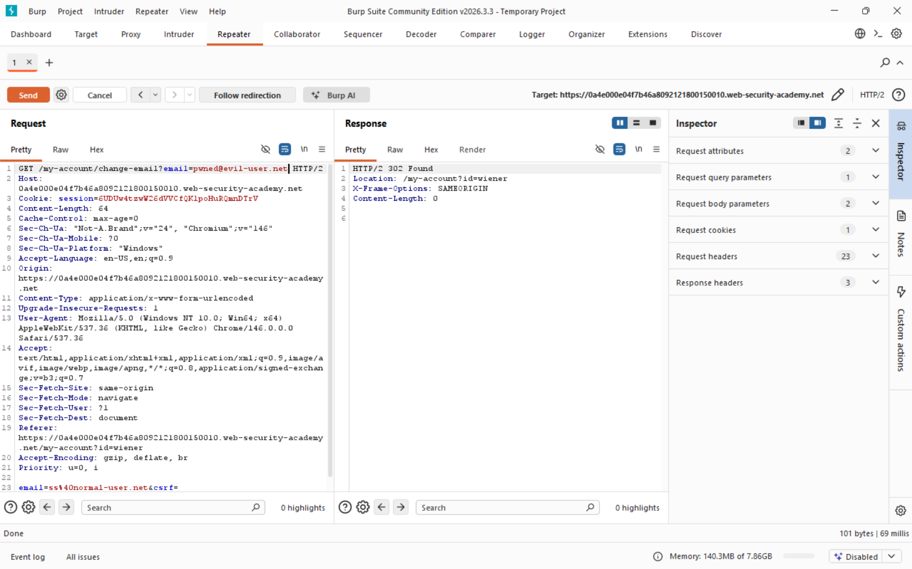
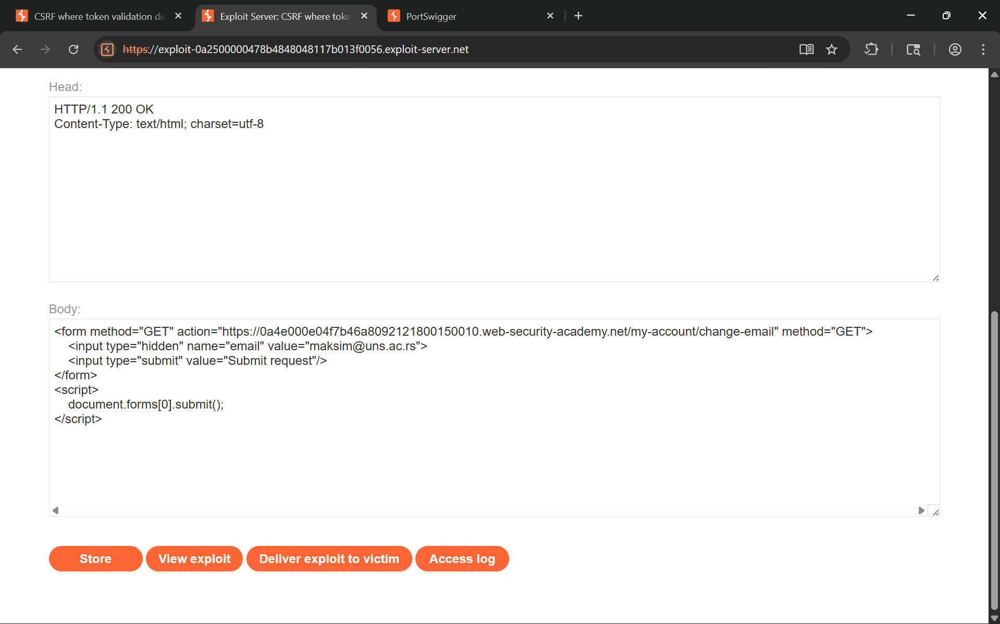

## Lab 2, medium: CSRF where token validation depends on request method

### Attack class

Same attack class as Lab 1. Cross-Site Request Forgery (CSRF) is an attack that tricks an authenticated user's browser into sending an unintended state-changing request to a web application. Because browsers automatically attach session cookies to every request destined for the origin that issued them, a malicious page hosted on a different domain can silently trigger actions on behalf of the victim without their knowledge or consent.

In this variant the application does attempt to protect against CSRF by issuing a token, but the validation logic only runs on POST requests. Switching to GET bypasses the check entirely - the endpoint processes the parameter from the query string and changes the email without ever verifying a token.

### Impact

Same impact as Lab 1. A successful CSRF attack lets an attacker perform any action the victim is authorized to perform:

- Account takeover through email or password change (as in this lab).
- Unauthorized fund transfers or purchases if the target is a banking or e-commerce application.
- Privilege escalation when an administrator visits the malicious page - the attacker inherits admin-level permissions for that forged request.
- Data exfiltration or deletion if state-changing endpoints also return sensitive data in the response.

The severity is directly proportional to the victim's privilege level and the sensitivity of available actions.

### Software weaknesses that enabled the attack

- The CSRF token validation was gated on the HTTP method: the server only verified the token when the request method was POST. When the same endpoint received a GET request it skipped validation entirely and executed the state change.
- The endpoint accepted both POST and GET for a state-changing operation. Idempotent GET semantics were not enforced - the handler read `email` from whichever parameter source was present (body or query string) without distinguishing between the two.
- The session cookie lacked the `SameSite` attribute, so the browser attached it to cross-site GET requests triggered by a `<form method="GET">`, giving the forged request a fully authenticated session.
- No `Origin` or `Referer` validation was performed, making it impossible for the server to detect that the GET request originated from a different domain.

### Countermeasures

#### Token validation must be method-agnostic:

- Apply CSRF token verification to every state-changing request regardless of HTTP method. Do not branch on `request.method == "POST"` as the condition for running the check.
- Ideally, disallow GET for any endpoint that mutates server state. Restrict state-changing operations to POST, PUT, PATCH, or DELETE, and return `405 Method Not Allowed` for GET on those routes.

#### SameSite cookie attribute blocks the browser-level vector:

- Set `SameSite=Strict` on session cookies so the browser never attaches them to cross-site requests of any method.
- Where `Strict` breaks legitimate cross-site navigations, use `SameSite=Lax` as the minimum - it blocks cross-site form submissions (including GET forms) while allowing top-level navigations.
- Pair `SameSite` with `Secure` and `HttpOnly` to reduce the attack surface further.

#### Defense-in-depth for sensitive endpoints:

- Validate the `Origin` and `Referer` headers server-side as a secondary check. Reject requests whose origin does not match the expected application domain.
- Require re-authentication (password confirmation) for high-impact actions such as email or password changes, even for already-authenticated sessions.
- Enforce strict HTTP method semantics at the framework or middleware level so that accidentally accepting GET on a mutation endpoint is caught at review or test time rather than in production.

## Solution writeup

Goal: Use the exploit server to craft a page that, when visited by the victim, forges a GET request to change their email address - bypassing the CSRF token check that only applies to POST.

- Step 1 - Analyze the email-change request
Log in with the provided credentials and change your email address while Burp Proxy is intercepting. Locate the resulting `POST /my-account/change-email` request. Note that this time the request body includes a `csrf` token parameter alongside `email`.

- Step 2 - Discover the method-based bypass
Send the captured request to Repeater. Change the method from POST to GET and move the `email` parameter to the query string, dropping the `csrf` token entirely. Send the request - the server responds with `302 Found` and processes the email change, confirming that token validation is skipped for GET requests.

Screenshot of the GET request in Repeater returning 302 without a CSRF token:



- Step 3 - Craft the CSRF exploit page
On the exploit server, write an HTML page with a GET form that auto-submits to the vulnerable endpoint:

```html
<form method="GET" action="https://<lab-id>.web-security-academy.net/my-account/change-email">
    <input type="hidden" name="email" value="attacker@web-security-academy.net">
    <input type="submit" value="Submit request"/>
</form>
<script>
    document.forms[0].submit();
</script>
```

No CSRF token is included. The browser will attach the victim's session cookie automatically.

- Step 4 - Deliver the exploit to the victim
Click **Store**, then **Deliver exploit to victim**. The victim's browser loads the page, the GET form auto-submits with their session cookie attached, and the application changes their email address.

Screenshot of the exploit payload on the exploit server before delivery:



- Step 5 - Confirm the lab is solved
The application processes the forged GET request and updates the victim's email, solving the lab.
