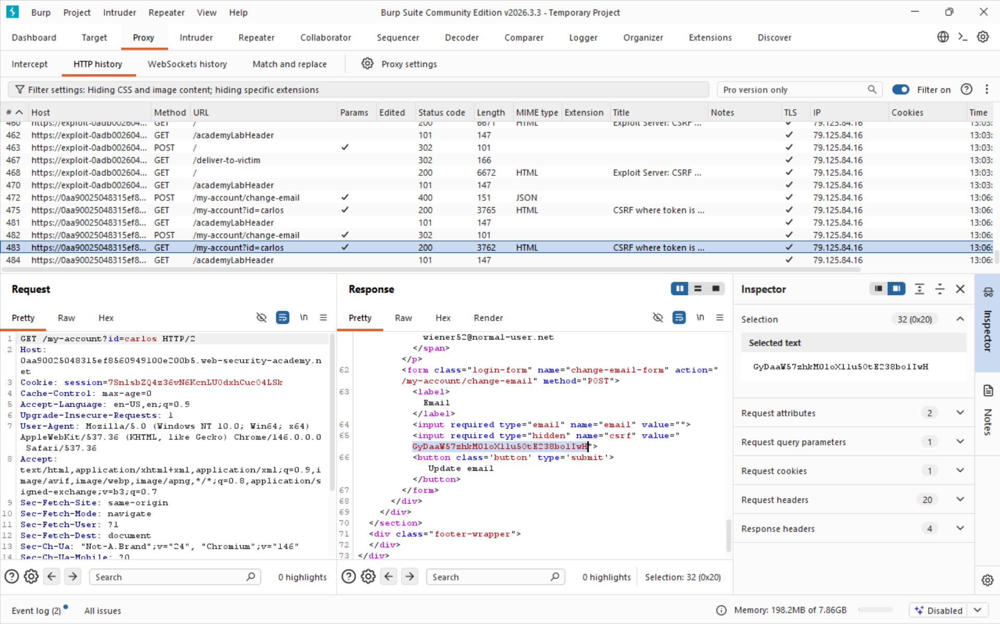
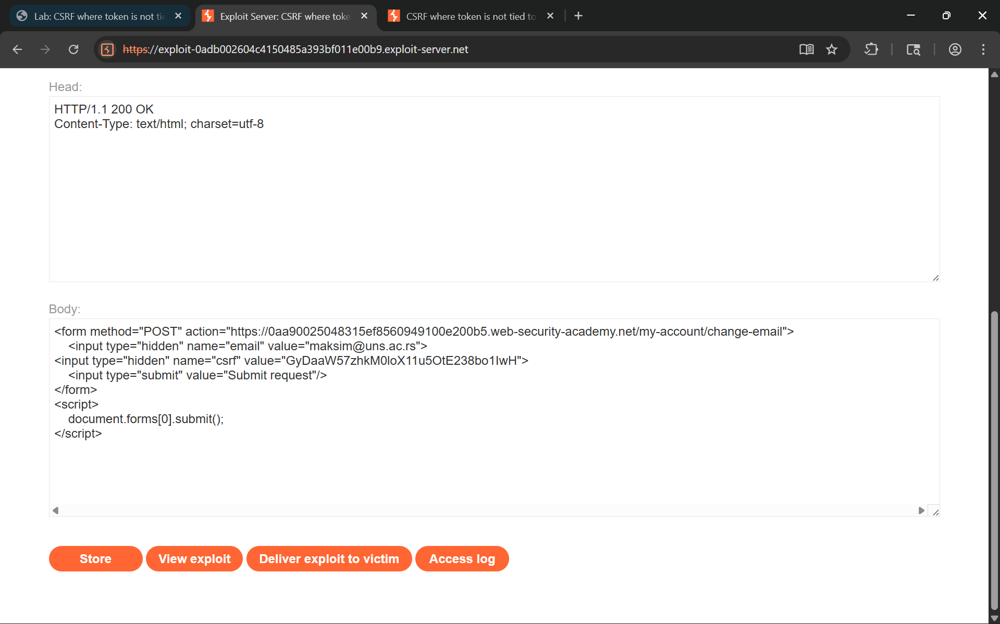

## Lab 4, medium: CSRF where token is not tied to user session

### Attack class

Same attack class as Lab 1. Cross-Site Request Forgery (CSRF) is an attack that tricks an authenticated user's browser into sending an unintended state-changing request to a web application. Because browsers automatically attach session cookies to every request destined for the origin that issued them, a malicious page hosted on a different domain can silently trigger actions on behalf of the victim without their knowledge or consent.

In this variant the application does generate CSRF tokens and validates their existence and correctness - but tokens are drawn from a global pool and are not bound to any specific user session. A token issued to attacker account A is equally valid when submitted alongside victim account B's session cookie. This means an attacker can obtain a legitimate token by simply logging into their own account, then embed it in a forged form delivered to the victim.

### Impact

Same impact as the previous labs. A successful CSRF attack lets an attacker perform any action the victim is authorized to perform:

- Account takeover through email or password change (as in this lab).
- Unauthorized fund transfers or purchases if the target is a banking or e-commerce application.
- Privilege escalation when an administrator visits the malicious page - the attacker inherits admin-level permissions for that forged request.
- Data exfiltration or deletion if state-changing endpoints also return sensitive data in the response.

The severity is directly proportional to the victim's privilege level and the sensitivity of available actions.

### Software weaknesses that enabled the attack

- CSRF tokens were stored in a global pool without being bound to the session that requested them. The server validated only that the submitted token existed in the pool, not that it was issued to the same session making the request.
- The `/my-account` endpoint exposed the account page - including the CSRF token embedded in the change-email form - to any authenticated user who knew the target's username via the `id` query parameter (`/my-account?id=carlos`). This allowed reading another user's token from the HTTP response.
- The session cookie lacked the `SameSite` attribute, so the browser attached it to cross-site POST requests submitted by an auto-submitting HTML form on an attacker-controlled page.
- No `Origin` or `Referer` validation was performed, leaving the server no way to detect that the request originated from a different domain.

### Countermeasures

#### Tokens must be bound to the specific session that requested them:

- When generating a CSRF token, store it server-side mapped to the current session ID (e.g., `session_store[session_id] = csrf_token`). During validation, verify both that the token exists and that it belongs to the session submitting the request.
- Alternatively, use the Double Submit Cookie pattern with a keyed HMAC: `csrf_token = HMAC(session_id, server_secret)`. The server recomputes the expected token from the session and secret and compares - a token from a different session will never match.
- Rotate tokens on each state-changing request (per-request tokens) so that even a leaked token cannot be reused.

#### Restrict access to sensitive page content:

- Do not expose another user's account page - including any embedded tokens - to third parties. Enforce authorization checks so that `/my-account?id=X` is only accessible to user X.
- Never embed a CSRF token in a URL or in a page that is accessible to users other than the token's owner.

#### SameSite cookie attribute blocks the browser-level vector:

- Set `SameSite=Strict` on session cookies so the browser never attaches them to cross-site requests.
- Where `Strict` breaks legitimate cross-site navigations, use `SameSite=Lax` as the minimum - it blocks cross-site form POSTs while allowing top-level navigations.
- Pair `SameSite` with `Secure` and `HttpOnly` to reduce the attack surface further.

## Solution writeup

Goal: Use the exploit server to craft a page that, when visited by the victim (carlos), forges a POST request to change their email address - using a valid CSRF token harvested from carlos's own account page.

- Step 1 - Analyze the email-change request
Log in with the provided credentials (wiener) and change your email address while Burp Proxy is intercepting. Locate the resulting `POST /my-account/change-email` request. The body includes both `email` and `csrf` parameters, and the server validates the token.

- Step 2 - Harvest carlos's CSRF token from the response
In Burp Proxy HTTP history, locate the `GET /my-account?id=carlos` request and inspect its response. The HTML of carlos's account page contains the change-email form with his current CSRF token embedded as a hidden field. Copy the token value from the response.

Screenshot of carlos's CSRF token visible in the GET response:



- Step 3 - Craft the CSRF exploit page
On the exploit server, write an HTML page with a POST form that includes carlos's harvested token hardcoded as the `csrf` value:

```html
<form method="POST" action="https://<lab-id>.web-security-academy.net/my-account/change-email">
    <input type="hidden" name="email" value="attacker@web-security-academy.net">
    <input type="hidden" name="csrf" value="<carlos-csrf-token>">
    <input type="submit" value="Submit request"/>
</form>
<script>
    document.forms[0].submit();
</script>
```

When carlos visits this page, his browser submits the form with his session cookie and his own CSRF token - both are valid, so the server accepts the request.

- Step 4 - Deliver the exploit to the victim
Click **Store**, then **Deliver exploit to victim**. The victim's browser loads the page, the form auto-submits carrying carlos's session cookie and the pre-planted CSRF token, and the application changes their email address.

Screenshot of the exploit payload with the harvested token on the exploit server:



- Step 5 - Confirm the lab is solved
The application validates the token (it exists and is correct) and the session (it belongs to carlos), finds both checks passing, and updates the email address - solving the lab.
