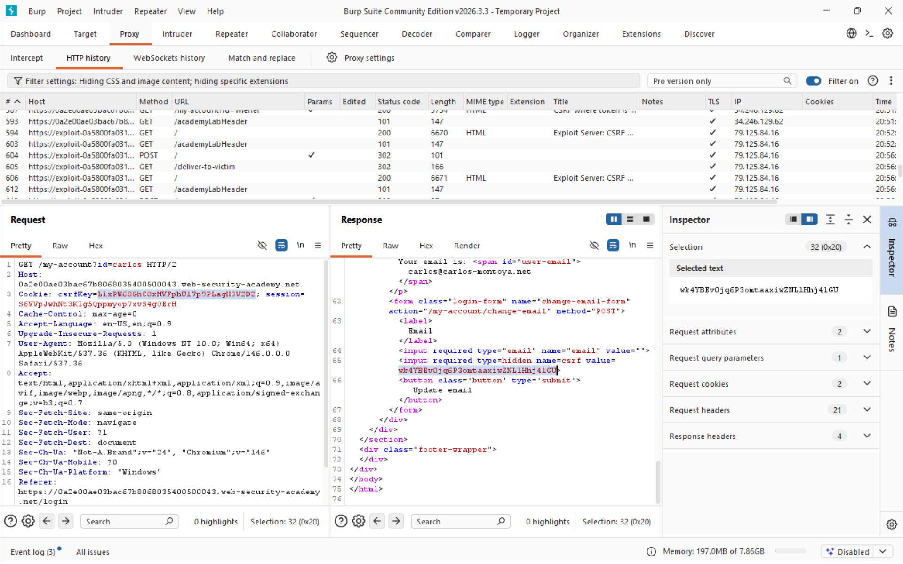
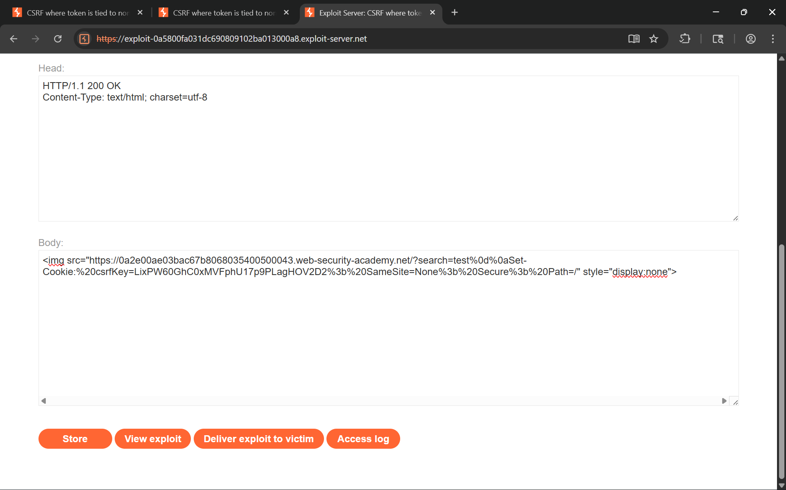
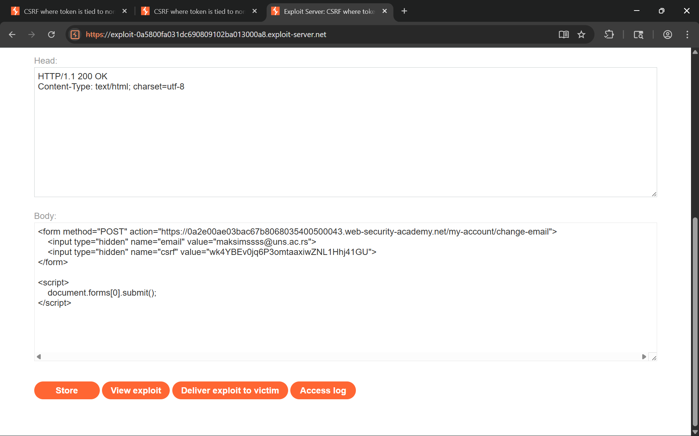

## Lab 5, medium: CSRF where token is tied to non-session cookie

### Attack class

Same attack class as Lab 1. Cross-Site Request Forgery (CSRF) is an attack that tricks an authenticated user's browser into sending an unintended state-changing request to a web application. Because browsers automatically attach session cookies to every request destined for the origin that issued them, a malicious page hosted on a different domain can silently trigger actions on behalf of the victim without their knowledge or consent.

In this variant the application validates a CSRF token by checking it against a separate `csrfKey` cookie rather than the session. This is stronger than a global token pool (Lab 4) since each token is paired with its own cookie - but the binding is to the `csrfKey` cookie, not to the user's session. An attacker who can plant an arbitrary `csrfKey` cookie in the victim's browser (e.g., via CRLF injection in a reflected endpoint) can then use their own matching `csrf`/`csrfKey` pair and have the server accept it.

### Impact

Same impact as the previous labs. A successful CSRF attack lets an attacker perform any action the victim is authorized to perform:

- Account takeover through email or password change (as in this lab).
- Unauthorized fund transfers or purchases if the target is a banking or e-commerce application.
- Privilege escalation when an administrator visits the malicious page - the attacker inherits admin-level permissions for that forged request.
- Data exfiltration or deletion if state-changing endpoints also return sensitive data in the response.

The severity is directly proportional to the victim's privilege level and the sensitivity of available actions.

### Software weaknesses that enabled the attack

- The CSRF token was validated against a dedicated `csrfKey` cookie rather than the user's session. While this creates a per-user token pair, the pair is not bound to the session identity - any valid `csrfKey`/`csrf` pair is accepted regardless of which user's session is present in the same request.
- The search endpoint reflected user input into the HTTP response headers without sanitisation. A newline sequence (`%0d%0a`) in the `search` query parameter caused CRLF injection, allowing an attacker to append an arbitrary `Set-Cookie` header to the response and plant a `csrfKey` cookie in the victim's browser.
- The injected cookie was accepted with `SameSite=None; Secure`, which instructed the browser to send it on all cross-site requests - including the forged POST that followed.
- The session cookie lacked `SameSite` protection and `Origin`/`Referer` validation was absent, so the forged POST carried both the legitimate session cookie and the attacker-planted `csrfKey` cookie.

### Countermeasures

#### Bind the CSRF token to the session, not to a separate cookie:

- Use the synchronizer token pattern: generate a token server-side, store it mapped to the current session ID, and validate that the submitted token matches the one bound to that session. A separate `csrfKey` cookie is not a session binding.
- Alternatively, derive the token with `HMAC(session_id, server_secret)` so no server-side state is required - but the token is still mathematically bound to the session and cannot be transplanted.

#### Prevent CRLF injection at the output layer:

- Strip or percent-encode `\r` and `\n` (and their encoded forms `%0d`, `%0a`, `%0D`, `%0A`) from any user-controlled value before including it in an HTTP response header.
- Use framework-provided header-setting APIs that automatically reject or encode newline characters rather than concatenating raw strings into response headers.
- Apply Content Security Policy (CSP) and cookie prefixes (`__Host-` or `__Secure-`) to prevent injected cookies from overriding legitimate ones.

#### SameSite cookie attribute blocks the browser-level vector:

- Set `SameSite=Strict` on session cookies so the browser never attaches them to cross-site requests.
- Where `Strict` breaks legitimate cross-site navigations, use `SameSite=Lax` as the minimum - it blocks cross-site form POSTs while allowing top-level navigations.
- Use the `__Host-` cookie prefix for the `csrfKey` cookie so the browser enforces that it can only be set by the target origin itself, preventing a cross-origin CRLF injection from planting it.

## Solution writeup

Goal: Use CRLF injection in the search endpoint to plant a known `csrfKey` cookie in the victim's browser, then deliver a forged POST form whose `csrf` token matches that planted cookie - satisfying the server's validation while using the victim's session.

- Step 1 - Capture the email-change request and identify the token scheme
Log in with the provided credentials and change your email address while Burp Proxy is intercepting. Locate the `POST /my-account/change-email` request. Note that it carries two separate cookies - `session` and `csrfKey` - and the request body contains a `csrf` parameter. The server validates that the `csrf` body value matches the `csrfKey` cookie value; the session cookie is not part of the check.

Screenshot of the request showing the `csrfKey` cookie alongside the `csrf` body parameter:



- Step 2 - Discover CRLF injection in the search endpoint
Test the `search` query parameter for header injection by appending `%0d%0aSet-Cookie:%20test=1` to a search request. If the response includes `Set-Cookie: test=1` as a header, the endpoint is vulnerable. This allows injecting an arbitrary cookie into any browser that fetches a crafted URL pointing to the target origin.

- Step 3 - Craft the two-stage exploit page
On the exploit server, build a page that first plants the attacker's own `csrfKey` cookie via the CRLF vulnerability, then auto-submits the forged form with the matching `csrf` token:

```html
.web-security-academy.net/?search=test%0d%0aSet-Cookie:%20csrfKey=<attacker-csrfKey>%3b%20SameSite=None%3b%20Secure%3b%20Path=/" style="display:none">

<form method="POST" action="https://<lab-id>.web-security-academy.net/my-account/change-email">
    <input type="hidden" name="email" value="attacker@web-security-academy.net">
    <input type="hidden" name="csrf" value="<attacker-csrf-token>">
</form>
<script>
    document.forms[0].submit();
</script>
```

The `` tag causes the victim's browser to fetch the injected URL, which plants the attacker's `csrfKey` cookie on the target origin. The form then submits immediately with the victim's `session` cookie, the newly planted `csrfKey` cookie, and the matching `csrf` body value - all three satisfy the server's checks.

Screenshot of the cookie-injection stage on the exploit server:



- Step 4 - Deliver the exploit to the victim
Click **Store**, then **Deliver exploit to victim**. The page loads in the victim's browser: the image request injects the `csrfKey` cookie, then the script submits the form. The server receives the victim's `session`, the attacker's `csrfKey`, and the matching `csrf` token - the `csrfKey`/`csrf` pair validates successfully and the email is changed.

Screenshot of the final exploit page combining cookie injection and the POST form:



- Step 5 - Confirm the lab is solved
The application processes the forged request and updates the victim's email address, solving the lab.
