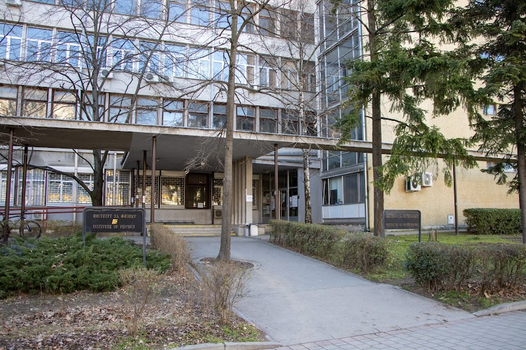
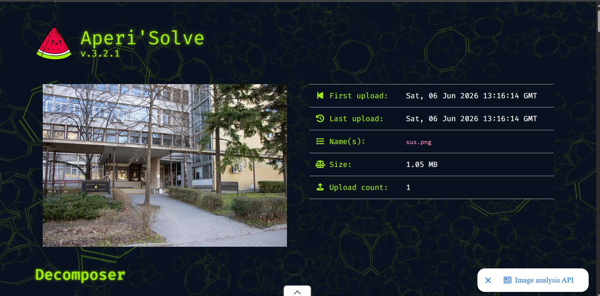
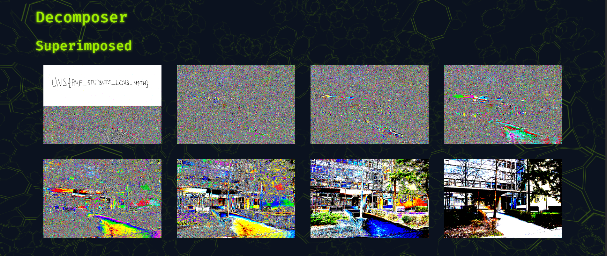
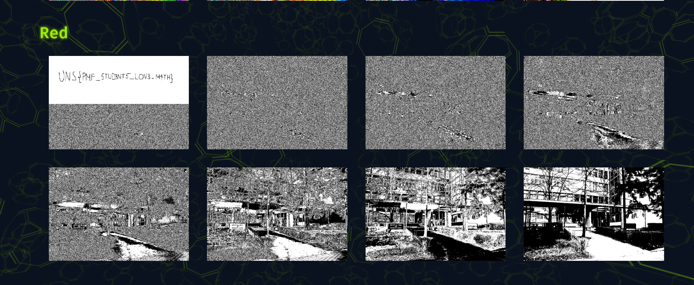
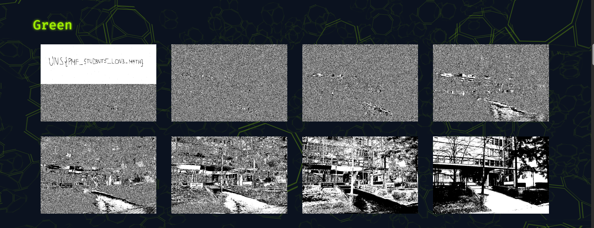

# Zadatak 6 - Pixel Perfect

**Flag format:** UNS{}  
**Flag:** UNS{PMF_STUD3NT5_LOV3_M4TH}

---

## Opis zadatka
U sklopu početnog foldera dobija se slika `sus.png` i opis 
`Your college mate likes to take photos in his spare time. He recently sent you a picture of him and said he
had something very important to tell you. Since then, there is no trace of him. Maybe you should take a closer look at 
the picture?` na osnovu kojih je potrebno pronaći traženi flag.  

---

## Opis rešenja 
- Na osnovu priloženog opisa zadatka, na samom početku je nagovešteno da je flag skriven na slici **(you should take a closer look at 
the picture)**.
- Kako bi se otkrio, upotrebljen je online alat **Aperi'Solve** za steganografsku analizu:  
  
- Aperi'Solve je pokrenuo više steganografskih alata odjednom: 
  - `zsteg` - analiza LSB steganografije u PNG fajlovima
  - `exiftool` - pregled skrivenih metapodataka
  - `binwalk` - traženje embedovanih fajlova unutar slike
  - `strings` - traženje čitljivog teksta u binarnom fajlu
- U **Superimposed** sekciji preklopljenih bitova jasno je prikazana skrivena poruka `UNS{PMF_STUD3NT5_LOV3_M4TH}`:  
  
- Flag je bio skriven u LSB (Least Significant Bit) slojevima slike, što je potvrđeno i kroz Red i Green kanal analize:  

  