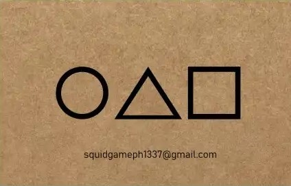
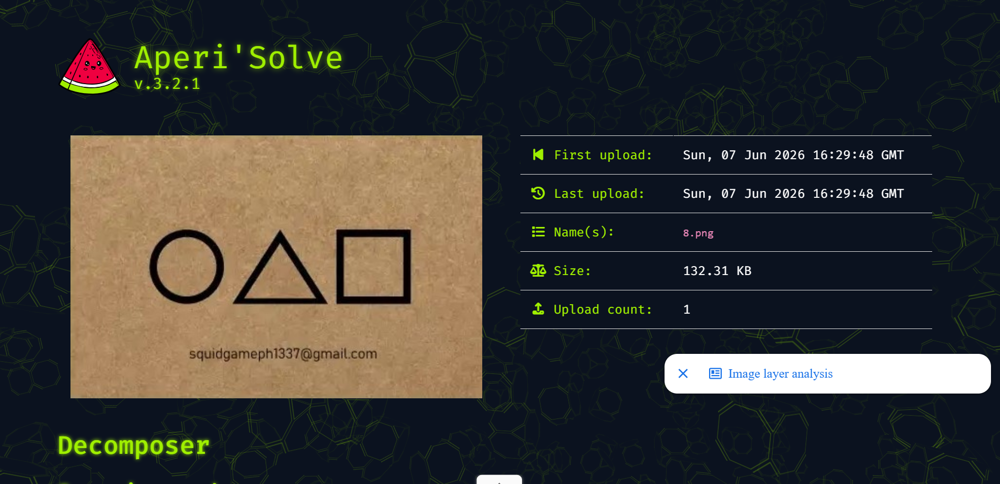
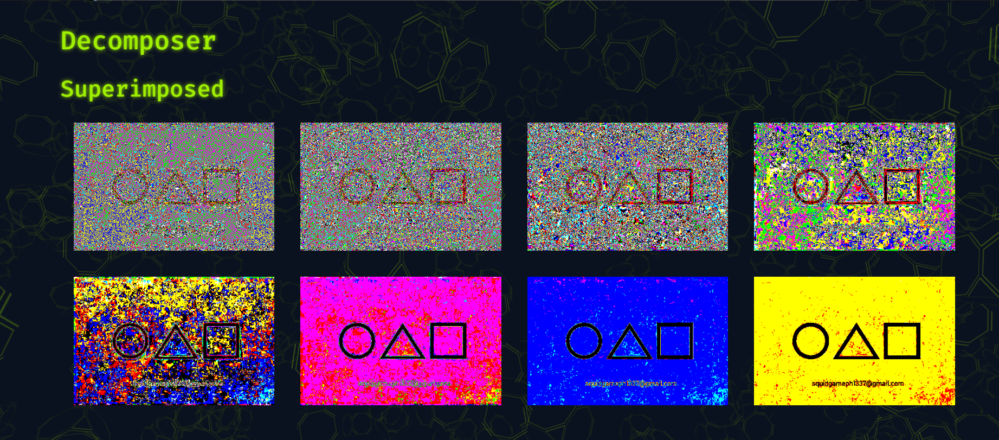
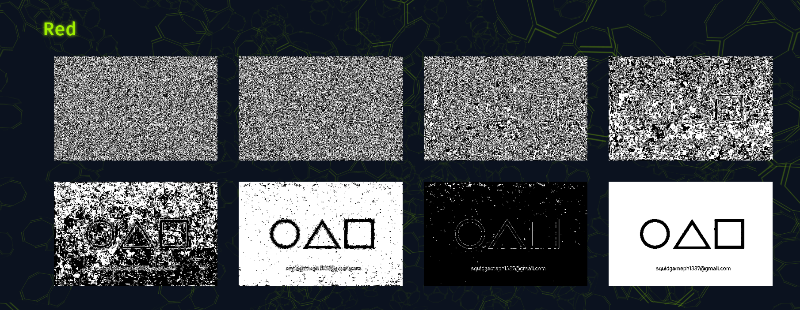
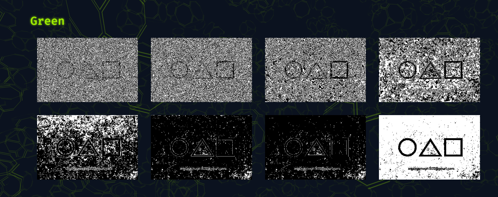
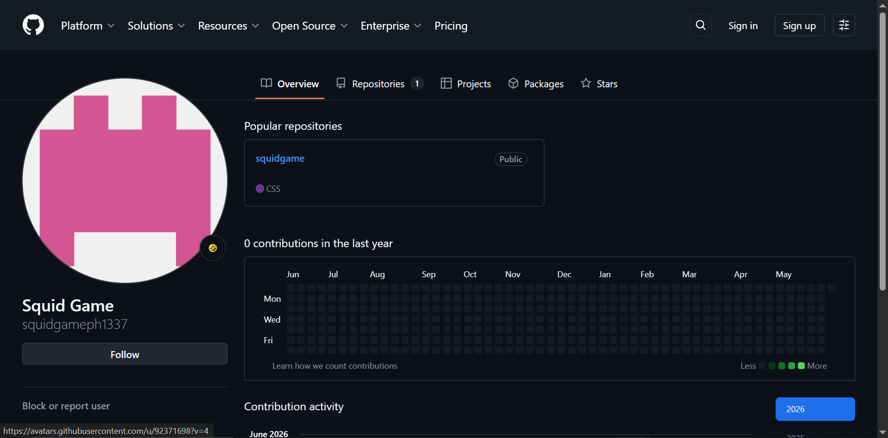
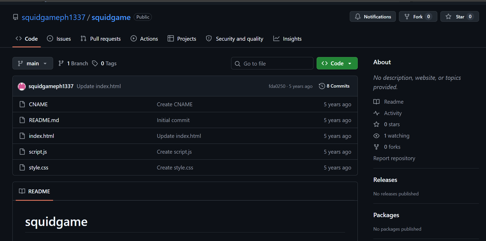
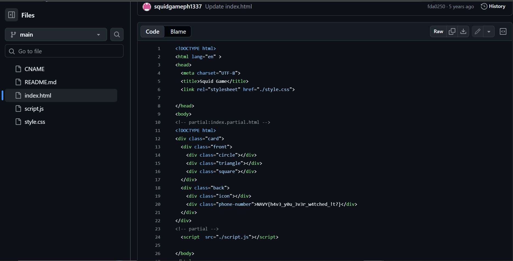

# Zadatak 8 - Squid Game Invitation

**Flag format:** NAVY{}  
**Flag:** `NAVY{h4v3_y0u_3v3r_w4tched_!t?}`

---

## Opis zadatka  
U sklopu početnog foldera dobija se slika `image.jpg` na osnovu koje je potrebno pronaći traženi flag.  
  

---

## Opis rešenja
- Prva ideja bila je steganografska analiza kako bi se utvrdilo da li je flag skriven na samoj slici.
- Slika je analizirana upotrebom **Aperi'Solve**:

- Ova analiza nije otkrila nijedan značajan skriveni detalj:
  
  

- Nakon steganografske analize, više pažnje se posvetilo samom sadržaju prikazanom na slici. 
- Navedena email adresa učinila se pogodnom za dalje istraživanje.
- Iz email adrese izvedeno je korisničko ime `squidgameph1337` čijom pretragom na različitim stranicama je otkriven 
GitHub nalog sa identičnim imenom:  

- Na pronađenom profilu prikazan je repozitorijum `squidgame`:  

- Nakon pregledanja njegovog sadržaja, u fajlu `index.html` otkriven je traženi flag `NAVY{h4v3_y0u_3v3r_w4tched_!t?}`
na 20. liniji koda  

